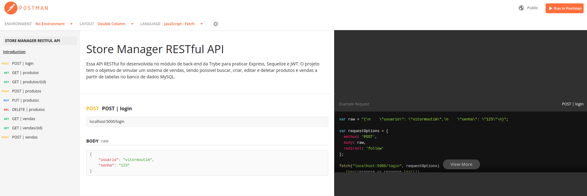

# API RESTful Blog

## Documentação:
[Link]([https://moutim-stats-spotify.herokuapp.com/](https://documenter.getpostman.com/view/19292971/UzBtnin7))

## Resumo do projeto

Essa API RESTful foi desenvolvida no módulo de back-end da Trybe para praticar Express, Sequelize e JWT. O projeto tem o objetivo de simular um sistema de vendas, sendo possivel buscar, criar, editar e deletar produtos e vendas a partir de tabelas no banco de dados MySQL.

## Tecnologias utilizadas

* JavaScript
* Sequelize
* JSON Web Token
* Express
